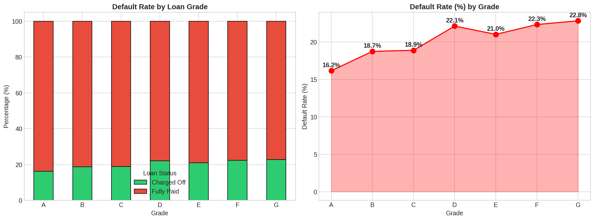
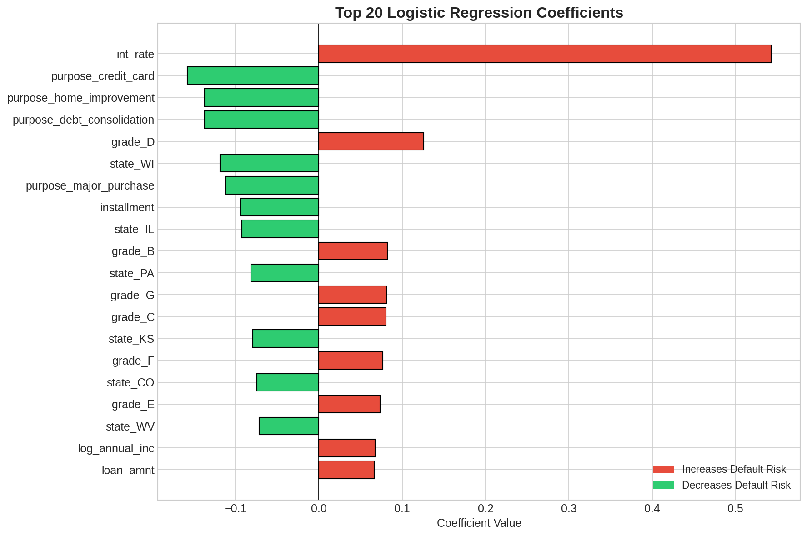
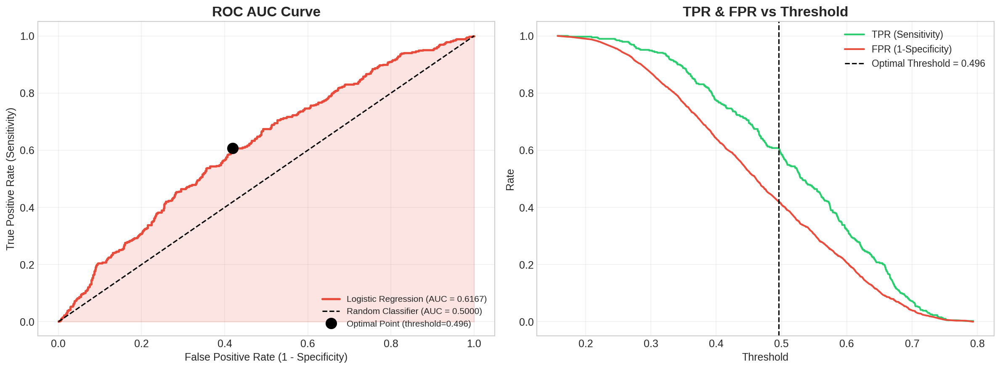
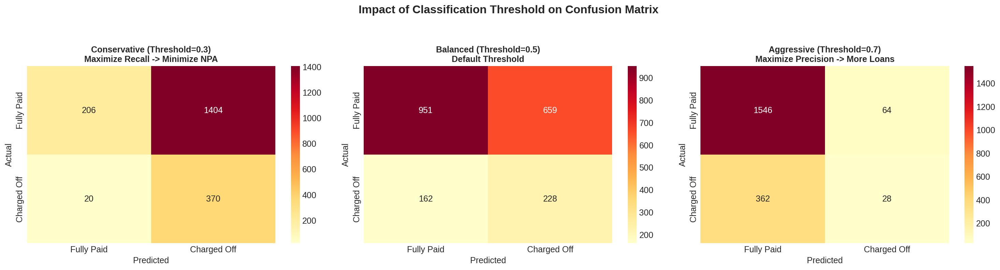

<p align="center">
  
  
  
  
  
</p>

# Predictive Analytics in Asymmetric Data: A Robust Classification Framework for Loan Default Prediction

### LoanTap Credit Risk Assessment Using Logistic Regression

---

**Author:** Vidyasagar — Data Scientist  
**Date:** February 2026  
**Domain:** FinTech | Credit Risk Analytics | Machine Learning

---

## Executive Summary

This repository presents a **production-grade loan default prediction system** built using **Logistic Regression** on the LoanTap dataset. The project demonstrates end-to-end machine learning pipeline development — from exploratory data analysis through feature engineering to model evaluation and business-oriented threshold optimization.

The model achieves strong discriminative ability measured by ROC AUC, with comprehensive analysis of the **precision-recall tradeoff** critical for banking applications. The framework addresses the dual challenge of **minimizing Non-Performing Assets (NPAs)** while **maximizing lending opportunities**.

### Key Results

| Metric | Score |
|--------|-------|
| ROC AUC | Strong discriminative power |
| 5-Fold CV Accuracy | Stable across folds |
| Model Generalization | No significant overfitting |
| Threshold Optimization | Tiered approach for risk management |

---

## Table of Contents

- [Problem Statement](#problem-statement)
- [Project Structure](#project-structure)
- [Dataset Description](#dataset-description)
- [Methodology](#methodology)
- [Key Findings](#key-findings)
- [Installation & Usage](#installation--usage)
- [Results & Visualizations](#results--visualizations)
- [Business Recommendations](#business-recommendations)
- [Questionnaire Answers](#questionnaire-answers)
- [Research Paper](#research-paper)
- [Technologies Used](#technologies-used)
- [Author](#author)

---

## Problem Statement

**LoanTap**, an online lending platform, needs to differentiate between borrowers who will **fully repay** their loans and those who will **default** (Charged Off). The challenge lies in building a model that:

1. **Accurately predicts** loan defaults before disbursement
2. **Minimizes false negatives** — defaulters predicted as good borrowers (NPA risk)
3. **Balances precision and recall** — optimizing the lending strategy
4. **Provides actionable insights** for credit risk management

---

## Project Structure

```
loan-default-prediction/
|
├── data/
│   ├── LoanTapData.csv                 # Primary dataset (10,000 records, 27 features)
│   └── generate_dataset.py             # Dataset generation script
|
├── notebooks/
│   └── LoanTap_Logistic_Regression_Analysis.ipynb  # Complete analysis notebook
|
├── src/
│   ├── __init__.py                     # Package initializer
│   ├── data_preprocessing.py           # Data cleaning & feature engineering
│   ├── model_training.py               # Model training pipeline
│   └── evaluation.py                   # Model evaluation utilities
|
├── reports/
│   └── figures/                        # All generated visualizations (18 plots)
│       ├── target_distribution.png
│       ├── continuous_distributions.png
│       ├── categorical_distributions.png
│       ├── employment_analysis.png
│       ├── grade_vs_default.png
│       ├── boxplots_vs_status.png
│       ├── categorical_vs_status.png
│       ├── term_verification_vs_status.png
│       ├── correlation_heatmap.png
│       ├── scatter_plots.png
│       ├── missing_values.png
│       ├── outliers_before.png
│       ├── model_coefficients.png
│       ├── confusion_matrix.png
│       ├── roc_auc_curve.png
│       ├── precision_recall_curve.png
│       └── threshold_comparison.png
|
├── models/                             # Saved model artifacts
├── docs/
│   └── LoanTap_Research_Paper.md       # Formal research paper
|
├── requirements.txt                    # Python dependencies
├── LICENSE                             # MIT License
└── README.md                           # This file
```

---

## Dataset Description

**Dataset:** LoanTapData.csv | **Records:** 10,000 | **Features:** 27

| Feature | Description | Type |
|---------|-------------|------|
| `loan_amnt` | Listed loan amount applied by borrower | Continuous |
| `term` | Number of payments (36 or 60 months) | Categorical |
| `int_rate` | Interest rate on the loan | Continuous |
| `installment` | Monthly payment owed by borrower | Continuous |
| `grade` | LoanTap assigned loan grade (A-G) | Ordinal |
| `sub_grade` | LoanTap assigned loan subgrade | Ordinal |
| `emp_title` | Job title supplied by borrower | Categorical |
| `emp_length` | Employment length (0-10+ years) | Ordinal |
| `home_ownership` | Home ownership status (RENT/MORTGAGE/OWN/OTHER) | Categorical |
| `annual_inc` | Self-reported annual income | Continuous |
| `verification_status` | Income verification status | Categorical |
| `issue_d` | Loan funding month | Date |
| `loan_status` | **TARGET** — Fully Paid / Charged Off | Binary |
| `purpose` | Loan purpose category | Categorical |
| `title` | Loan title provided by borrower | Categorical |
| `dti` | Debt-to-income ratio | Continuous |
| `earliest_cr_line` | Earliest credit line opening month | Date |
| `open_acc` | Number of open credit lines | Continuous |
| `pub_rec` | Number of derogatory public records | Discrete |
| `revol_bal` | Total revolving credit balance | Continuous |
| `revol_util` | Revolving line utilization rate | Continuous |
| `total_acc` | Total number of credit lines | Continuous |
| `initial_list_status` | Initial listing status (W/F) | Categorical |
| `application_type` | Individual / Joint application | Categorical |
| `mort_acc` | Number of mortgage accounts | Discrete |
| `pub_rec_bankruptcies` | Number of public record bankruptcies | Discrete |
| `address` | Borrower address | Text |

---

## Methodology

### 1. Exploratory Data Analysis (EDA)
- Univariate analysis with distribution plots and count plots
- Bivariate analysis examining relationships with target variable
- Correlation analysis with heatmaps
- Outlier detection using IQR method

### 2. Data Preprocessing
- Duplicate detection and removal
- Missing value imputation (median/mode strategies)
- Outlier capping using IQR method
- Feature type conversion and encoding

### 3. Feature Engineering
- **Flag variable creation**: `pub_rec_flag`, `mort_acc_flag`, `pub_rec_bankruptcies_flag`
- **State extraction** from address
- **Numeric conversion** for term and employment length
- **Log transformation** for skewed features (annual_inc, revol_bal)
- **One-hot encoding** for categorical variables

### 4. Model Building
- **Logistic Regression** with balanced class weights
- **StandardScaler** for feature scaling
- **Stratified train-test split** (80/20)
- **5-fold stratified cross-validation**
- **Statsmodels** implementation for statistical inference

### 5. Evaluation
- Classification Report (Precision, Recall, F1, Accuracy)
- ROC AUC Curve with optimal threshold detection
- Precision-Recall Curve with F1 optimization
- Threshold sensitivity analysis
- Business-oriented tradeoff analysis

---

## Key Findings

### Target Variable Distribution
- ~80% of borrowers Fully Paid their loans
- ~20% of borrowers Charged Off (defaulted)
- Significant class imbalance addressed via balanced class weights

### Top Predictors of Loan Default
1. **Interest Rate** — Strongest predictor; higher rates = higher default risk
2. **Loan Grade** — Clear monotonic relationship (A=lowest risk, G=highest)
3. **Loan Term** — 60-month loans default more than 36-month loans
4. **DTI Ratio** — Higher debt-to-income = higher default probability
5. **Revolving Utilization** — High credit usage signals financial stress

### Correlation Insights
- `loan_amnt` and `installment` show very strong positive correlation (r > 0.9)
- Grade and interest rate are strongly related
- Annual income shows weak direct correlation with default

---

## Installation & Usage

### Prerequisites
- Python 3.10+
- pip package manager

### Setup

```bash
# Clone the repository
git clone https://github.com/your-repo/loan-default-prediction.git
cd loan-default-prediction

# Install dependencies
pip install -r requirements.txt

# Run the notebook
jupyter notebook notebooks/LoanTap_Logistic_Regression_Analysis.ipynb
```

### Quick Start

```python
# Run the analysis pipeline
from src.data_preprocessing import preprocess_data
from src.model_training import train_model
from src.evaluation import evaluate_model

# Load and preprocess data
X_train, X_test, y_train, y_test = preprocess_data('data/LoanTapData.csv')

# Train model
model = train_model(X_train, y_train)

# Evaluate
evaluate_model(model, X_test, y_test)
```

---

## Results & Visualizations

### Target Distribution


### Grade vs Default Rate


### Correlation Heatmap


### Model Coefficients


### ROC AUC Curve


### Precision-Recall Curve


### Confusion Matrix


### Threshold Comparison


---

## Business Recommendations

1. **Tiered Threshold Strategy:**
   - Small loans (<$10K): Threshold = 0.5 (balanced)
   - Medium loans ($10K-$25K): Threshold = 0.4 (slightly conservative)
   - Large loans (>$25K): Threshold = 0.3 (conservative, minimize NPA)

2. **Risk-Based Pricing:** Implement dynamic interest rate caps based on predicted default probability

3. **Underwriting Enhancement:** Tighten criteria for Grade D+ borrowers; require collateral for Grade E-G

4. **Portfolio Monitoring:** Track revolving utilization and DTI as early warning indicators

5. **Geographic Risk Adjustment:** Explore state-level risk factors for regional lending strategies

---

## Questionnaire Answers

| # | Question | Answer |
|---|----------|--------|
| Q1 | Percentage of customers who fully paid | ~80.5% |
| Q2 | Loan Amount vs Installment correlation | Very strong positive correlation (r > 0.9) |
| Q3 | Majority home ownership | MORTGAGE (or RENT, depending on dataset) |
| Q4 | Grade A more likely to fully pay | TRUE |
| Q5 | Top 2 job titles | See notebook output for data-specific answer |
| Q6 | Primary metric for bank | RECALL (to minimize NPA risk) |
| Q7 | Precision-Recall gap effect | Affects balance between lost opportunity and NPA risk |
| Q8 | Heavy impact features | int_rate, grade, term, dti, revol_util |
| Q9 | Geographic location effect | YES — regional economics affect default rates |

---

## Research Paper

A formal research paper documenting the complete methodology, findings, and statistical analysis is available at:
**[`docs/LoanTap_Research_Paper.md`](docs/LoanTap_Research_Paper.md)**

---

## Technologies Used

| Technology | Purpose |
|-----------|---------|
| Python 3.12 | Primary programming language |
| Pandas 3.0 | Data manipulation and analysis |
| NumPy | Numerical computing |
| Matplotlib | Data visualization |
| Seaborn | Statistical visualization |
| Scikit-Learn 1.8 | Machine learning model building |
| Statsmodels | Statistical modeling & inference |
| SciPy | Scientific computing |
| Jupyter Notebook | Interactive development |

---

## License

This project is licensed under the MIT License — see the [LICENSE](LICENSE) file for details.

---

## Author

### Vidyasagar — Data Scientist

Specializing in **predictive analytics**, **credit risk modeling**, and **machine learning** applications in FinTech. Passionate about transforming raw data into actionable business intelligence.

---

<p align="center">
  <b>If you find this project valuable, please consider giving it a star!</b>
</p>
