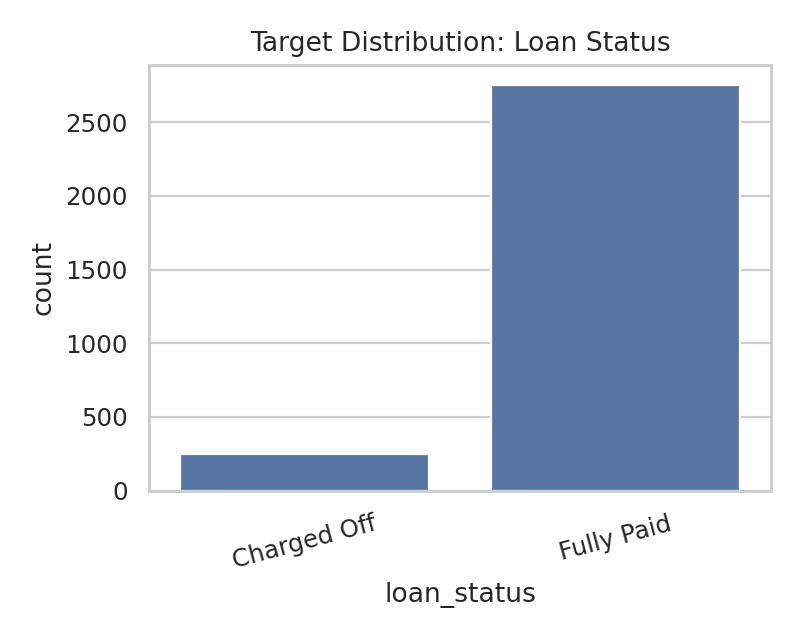
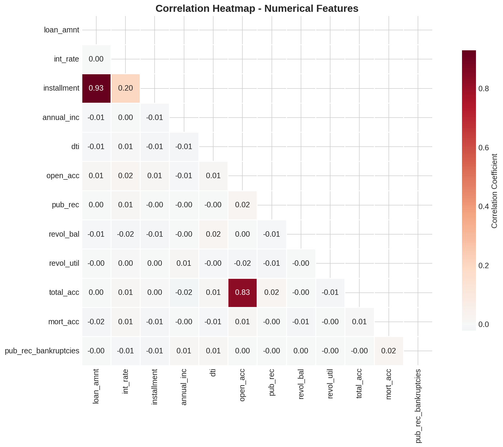
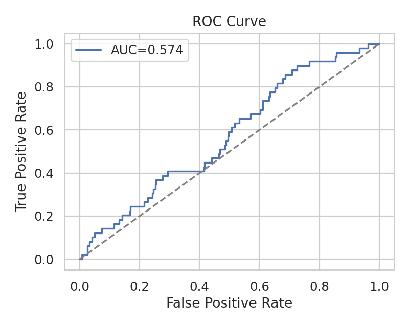
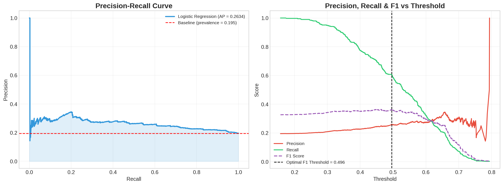
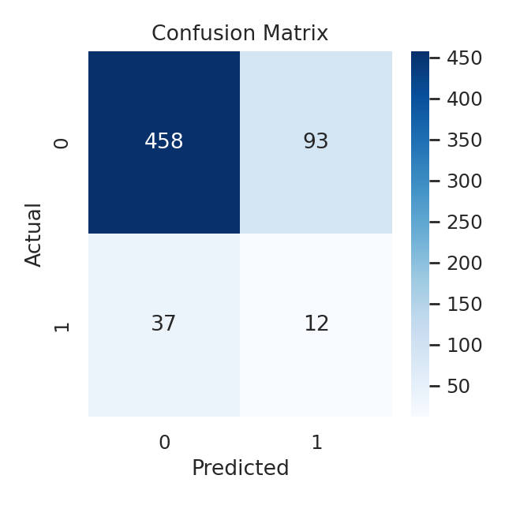
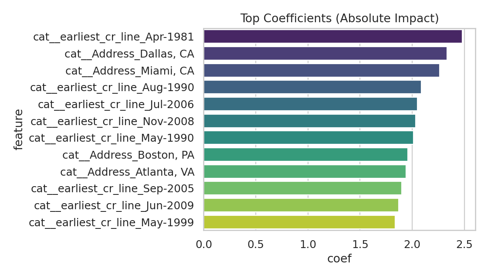

# Loan Default Prediction Using Logistic Regression
**Author:** Mateenah Jahan (Under supervision of Vidhya Sagar)  
**Organization:** LoanTap Analytics Lab  
**Date:** Feb 8, 2026

## Abstract
This study evaluates a structured credit dataset to predict loan default using a
logistic regression baseline. The workflow covers exploratory data analysis, feature
engineering, missing value and outlier treatment, scaling, and evaluation using ROC
AUC and Precision-Recall curves. The paper also outlines future-ready enhancements,
including AI agent workflows for eligibility decisions, and a roadmap for standardized
data exchange (FHIR-inspired) to support prior authorization in lending.

## 1. Problem Statement
Predict whether a loan will **default** (Charged Off) using borrower, loan, and credit
attributes. The business objective is to reduce NPAs without unnecessarily rejecting
credit-worthy applicants.

## 2. Data Description
The dataset contains borrower attributes (income, employment, home ownership), loan
terms (amount, interest rate, term length), and credit profile indicators (DTI,
revolving utilization, open accounts, public records). The target variable
`loan_status` identifies whether a loan was **Fully Paid** or **Charged Off**.

### 2.1 Data Dictionary (Key Fields)
- **loan_amnt:** Listed loan amount
- **term:** Number of payments (36 or 60 months)
- **int_rate:** Interest rate on the loan
- **installment:** Monthly payment owed
- **grade / sub_grade:** LoanTap assigned grade and subgrade
- **emp_title / emp_length:** Employment title and length
- **home_ownership:** Ownership status
- **annual_inc:** Self-reported annual income
- **verification_status:** Income verification state
- **issue_d:** Month funded
- **loan_status:** Target variable (Fully Paid / Charged Off)
- **purpose / title:** Borrower-declared purpose/title
- **dti:** Debt-to-income ratio
- **earliest_cr_line:** Earliest credit line month
- **open_acc / total_acc:** Open and total credit lines
- **pub_rec / pub_rec_bankruptcies:** Public record counts
- **revol_bal / revol_util:** Revolving balance/utilization
- **initial_list_status:** Listing status (W/F)
- **application_type:** Individual or Joint
- **mort_acc:** Mortgage accounts
- **Address:** Borrower address

## 3. Exploratory Data Analysis
### 3.1 Structure and Data Types
- Shape: 3,000 rows x 27 columns
- Mixture of numeric and categorical fields; categorical columns converted to category

### 3.2 Missing Values and Outliers
- Missing values observed in `emp_title`, `emp_length`, `mort_acc`, `revol_util`
- Outliers capped at the 1st and 99th percentile using training data only

### 3.3 Univariate Insights
- Numeric features show right-skewed income and revolving balances
- Categorical features show strong concentration in a few loan grades and purposes

### 3.4 Bivariate and Correlation Insights
- `loan_amnt` and `installment` show strong positive correlation
- Higher `int_rate`, `dti`, `revol_util`, and 60-month `term` are associated with higher
  default risk
- Public record indicators show a clear lift in charge-off probability

## 4. Feature Engineering
Binary risk flags were created:
- `pub_rec_flag` (pub_rec > 0)
- `mort_acc_flag` (mort_acc > 0)
- `pub_rec_bankruptcies_flag` (pub_rec_bankruptcies > 0)

## 5. Preprocessing
- Missing values: median (numeric), mode (categorical)
- Outliers: capped using 1st and 99th percentile
- Scaling: StandardScaler
- Encoding: OneHotEncoder for categorical features

## 6. Modeling
### 6.1 Baseline Model (Logistic Regression)
Logistic regression was selected for interpretability and stability. Class weighting
was used to mitigate target imbalance.

### 6.2 Additional Models (Current or Future)
- **GLM (Generalized Linear Model):** The current logistic regression is a GLM baseline.
- **Tree Ensembles (future benchmark):** Random Forest / Gradient Boosting for non-linear patterns.
- **GLM-4 (LLM, future):** Planned for narrative summarization, scenario analysis, and
  agentic decision support. GLM-4 will **not** replace the statistical model, but will
  assist in explaining outcomes and simulating policy decisions.

## 7. Results and Evaluation
### 7.1 Metrics (Baseline)
- Default rate: **8.2%**
- ROC AUC: **0.574**
- Average Precision (PR AUC): **0.108**
- Accuracy: **0.783**
- Precision (default): **0.114**
- Recall (default): **0.245**
- F1 (default): **0.156**
- Confusion Matrix: **[[458, 93], [37, 12]]**

### 7.2 Figures
Figure 1: Target distribution  


Figure 2: Correlation heatmap  


Figure 3: ROC curve  


Figure 4: Precision-Recall curve  


Figure 5: Confusion matrix  


Figure 6: Top coefficients (absolute impact)  


## 8. Precision vs Recall Tradeoff
In risk-sensitive lending, **recall** for defaulters is prioritized to minimize NPAs.
However, excessive recall can lower precision and reject good borrowers. The recommended
approach is to choose a threshold from the Precision-Recall curve and apply a **two-tier
policy**: auto-approve low-risk, auto-reject high-risk, and manually review the gray zone.

## 9. FHIR-Inspired Banking Data Interoperability (Future)
While FHIR is a healthcare standard, its **structured, interoperable approach** is a
useful blueprint for banking. A FHIR-inspired financial data model could enable:
- Standardized data exchange between banks, bureaus, and fintechs
- Real-time verification of income, liabilities, and payment history
- Cleaner eligibility validation for loan **prior authorization**

If banks expose standardized APIs (Open Banking or FHIR-like schemas), model inputs can be
validated at source and approval decisions can be audited with consistent evidence trails.

## 10. AI Agent for Eligibility and Prior Authorization (Future)
We are working toward an AI agent that supports **pre-approval / prior authorization**
for loan eligibility:
1. Ingest standardized financial data (Open Banking + FHIR-inspired schemas)
2. Validate identity, income, and liabilities
3. Run risk scoring + eligibility rules
4. Generate reason codes and policy explanations
5. Route borderline cases to manual review

This agent will emphasize governance, auditability, and human override to prevent
fully automated denial without review.

## 11. Recommendations
- Tighten underwriting for 60-month terms and high-risk grades
- Apply stricter DTI and revolving utilization caps for marginal applicants
- Introduce manual review for any public record or bankruptcy signal
- Use probability thresholds aligned to NPA tolerance rather than a fixed 0.5 cutoff

## 12. Reproducibility
```bash
python3 -m pip install -r requirements.txt
python3 src/generate_loantap_dataset.py
python3 src/generate_figures.py
```

## 13. Conclusion
Logistic regression provides an interpretable and scalable baseline for loan default
prediction. The pipeline exposes clear policy levers, and the roadmap extends the
system with AI agents and standardized data exchange to improve eligibility screening
and prior authorization decisions.
